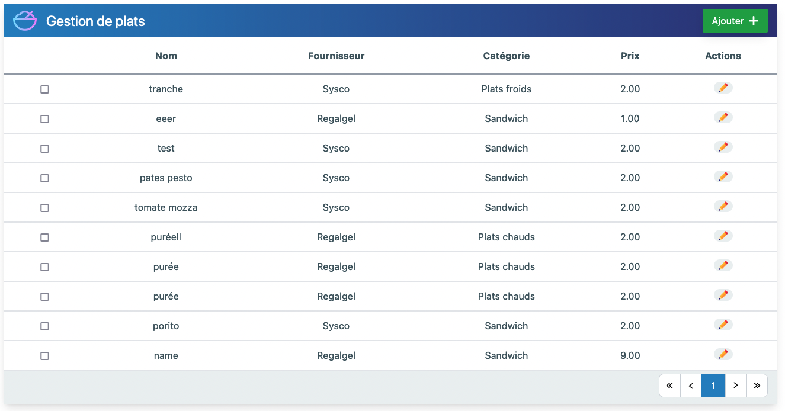
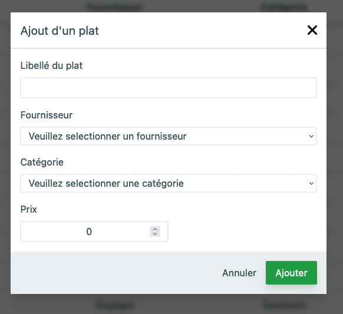

## Gestion des plats Full Stack

## Description
Full Stack Project - CRUD TABLE

It's a management table to handle all dishes served in a school.
The table displays all the existing dishes. Only 10 dishes are displayed by pages. It's possible to navigate throught the different pages easily.

It's possible :
- to add a new dish
- edit an existing dish
- delete the selected dish(es)

A form is used to create and edit dished. The front validation of the form has been realized using Formik and Yup.
Back-end validation was handled with GUMP.

Front-end was realized with React and Tailwind.

## How to install the project
- Clone the repository in your IDE
- In your terminal execute : 
  - npm install
  - npm run dev
  - npx tailwindcss -i ./src/style/index.css -o ./src/dist/output.css --watch

- For the database: 
  - Download the db file 'DB_schoolDish' 
  - Start Mysql 
  - In MySql create a table named "schoolDish"
  - In this new table, import the sql request from 'DB_schoolDish'
  - In the document api/DbConnection set your username and password

## Context
This project has been realized on December 2022 while I was doing a 7-month boot camp.
This project aim to test my abilities in doing a full stack project.

## What's to improve?
There is no searchbar so far. 

A page to handle providers and categories could be added.

## Overview of the project

